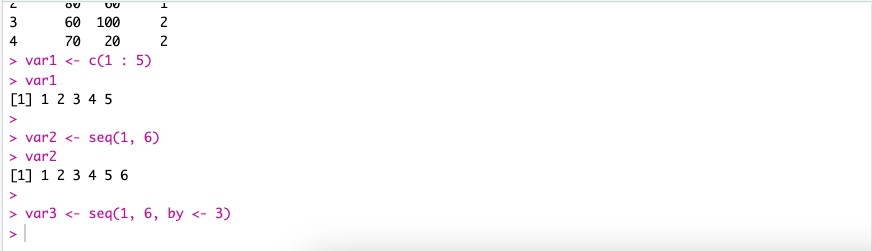
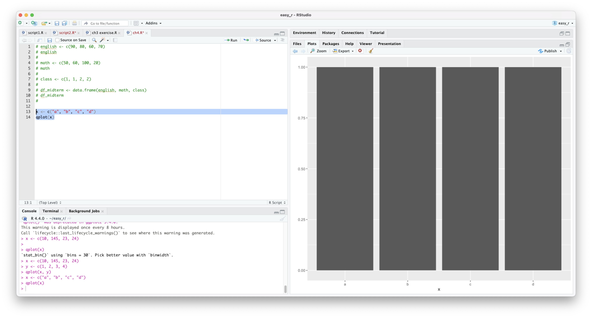
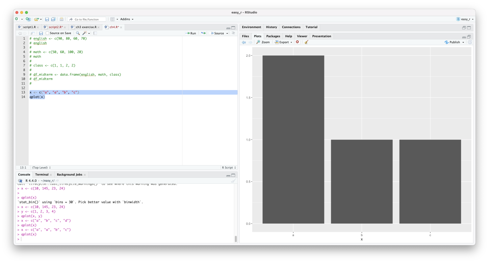
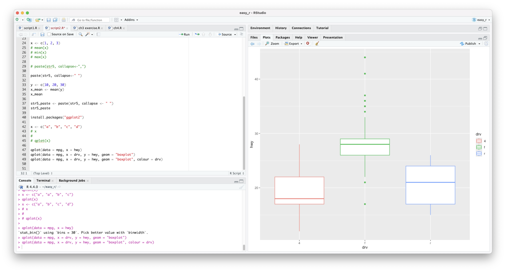

# R
## ch1 R 넌 머임
### R이란
데이터를 분석하는 데 사용하는 소프트웨어이다.

### 어디다 씀
많은 사람이 R을 쓰는 이유는 다양성임 여러 데이터 분석 사례를 확인할 수 있음
1. 통계분석
   다양한 통계분석 기법을 활용할 수 있음
2. 머신러닝 모델링
   최신 머신러닝 알고리즘을 쉽게 사용할 수 있음
3. 텍스트 마이닝
   문자로 이루어진 데이터를 분석할 수 있음
4. 소셜 네트워크 분석
   소셜 네트워크 분석 기술을 활용할 수 있음
5. 지도 시각화
   위도, 경도등 지리 정보 활용가능
6. 주식 분석
   온라인 주식 관련 데이터를 수집하여 분석할 수 있음
7. 이미지 분석
   사진, 그림 등의 이미지에서 속성을 추출하여 데이터로 변환할 수 있음
8. 사운드 분석
   소리 데이터에서 진폭, 음략 속성등으로 데이터화, 시각화 할 수 있음
9. 웹애플리케이션 개발
   데이터를 활용한 애플리케이션 개발 가능함

## ch2, 3 기본적인 문법

### 대입연산
```r
a <- 1
```

### 열 데이터 생성하기
```r
var1 <- c(1, 2, 3, 4)
```

### 문자열 데이터 할당하기
```r
str1 <- "a"
```

### 여러 문자열 데이터 할당하기
```r
str2 <- c("hello", "world", "is", "good!")
```

### 열 데이터 평균 구하기
```r
scores <- c(10, 20, 30, 40)
scores_mean <- mean(scores)
```

### 문자열 데이터 구분자를 사용하여 복사하기
```r
str3 <- c("hello", "world", "is", "good")
paste(str3, collapse<-" ")
```

### sequence 데이터를 생성하는 2가지 방법
```r
var1 <- c(1 : 5)
var1

var2 <- seq(1, 6)
var2

var3 <- seq(1, 6, by <- 3)
```



### ggplot2 패키지 설치하기
1. 패키지 설치하기
2. 패키지 로드하기
3. 함수 사용하기

패키지는 한 번만 설치하면 되지만 패키지를 로드하는 작업은 R스튜디오를 새로 시작할 때마다 반복해야 한다.

```R
## ggplot2패키지 설치
install.package("ggplot2")
```

```R
## ggplot2 패키지 로드
library(ggplot2)
```

### qplot로 빈도 수 확인해보기
```R
## 빈도수 확인해보기1
x <- c("a", "b", "c", "d")
qplot(x)
```



```R
## 빈도수 확인해보기2
x <- c("a", "a", "b", "c")
qplot(x)
```


### qplot으로 예제 데이터를 사용해 그래프를 그려보기

```R
x <- c("a", "b", "c", "d")

## qplot의 파라미터
## data : mpg
## x : x축의 데이터

qplot(data = mpg, x = hwy)
qplot(data = mpg, x = drv, y = hwy, geom = "boxplot")
qplot(data = mpg, x = drv, y = hwy, geom = "boxplot", colour = drv)
```

mpg 데이터는 미국 환경 보호국애서 공개한 자료로, 1999-2008년 사이 미국에서 출시도니 자동차 234종의 연비관련 정보를 담고 있다.

hwy는 자동차가 고속도로에서 1갤런에 몇 마일을 가는지 나타낸 변수이다.



